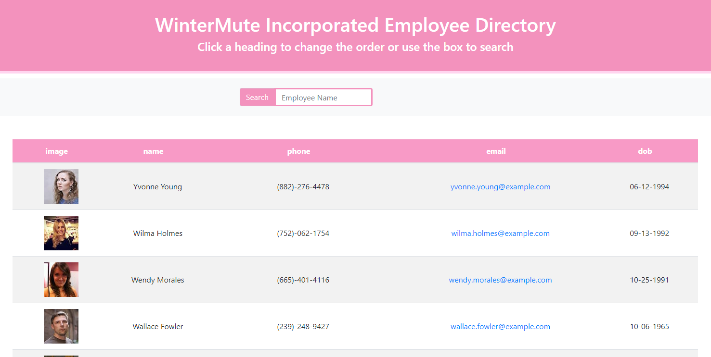
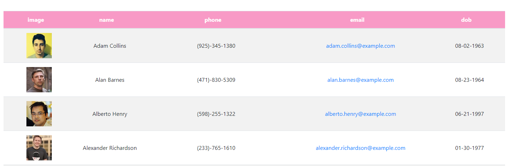
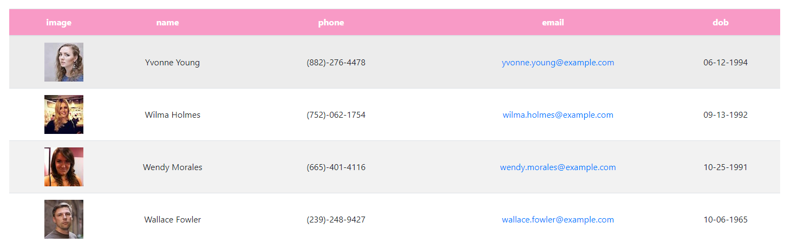
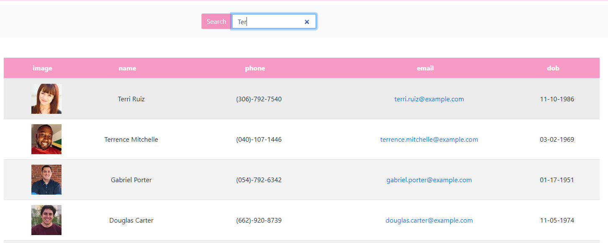

# Find that Employee 

## Description

This is a React app that will allow an employer to easily find an employee's contact information. Columns can be sorted in ascending or descending order and a search field allows for quick searching. I set it up to populate using a random user api to show what it would look like for a larger company. See the demo version here: <https://melindawinter.github.io/employee-directory/>

## Table of Contents

- [Installation](#installation)
- [Usage](#usage)
- [Technologies](#technologies)
- [License](#license)
- [Contributing](#contributing)
- [Tests](#tests)
- [Questions](#questions)
- [Credits](#credits)

## Installation

If you would like to use part of this app, please clone my project. Make sure you have node.js installed on your computer. You can find the download here <https://nodejs.org/en/download/>.

## Usage

To use the demo version of the app, simply click on a heading to reverse the ascending/descending filter function or begin typing a name in the search bar.

To start a version you have cloned, use npm start to run the app on the local host and view it in the browser.

## Technologies

This project was bootstrapped with [Create React App](https://github.com/facebook/create-react-app).

## License

GNU General Public License v3.0

The GNU License allows the software to be modified and distributed by other users. It does not impose any restrictions on the use of the software but requires that it remain open source.

## Contributing

Please contribute to this project if you feel that you can make the code more efficient. Create your own branch and submit a pull request. I ask that you follow the Contributor Covenant code of conduct: <https://www.contributor-covenant.org/version/2/0/code_of_conduct/code_of_conduct.md> 

## Tests

To run the tests for the project, type npm run test into the command line.

## Questions

- [Github Profile](https://github.com/melindawinter)
- melindawinter42@gmail.com
- You can easily reach me by email or you can find me on LinkedIn here <http://www.linkedin.com/in/melinda-winter-34a25689>.

## Credits

I used a random user generator app found here: <https://randomuser.me/>. Thank you to my tutor Thor Nolan for helping me get the project set up and on its way.
